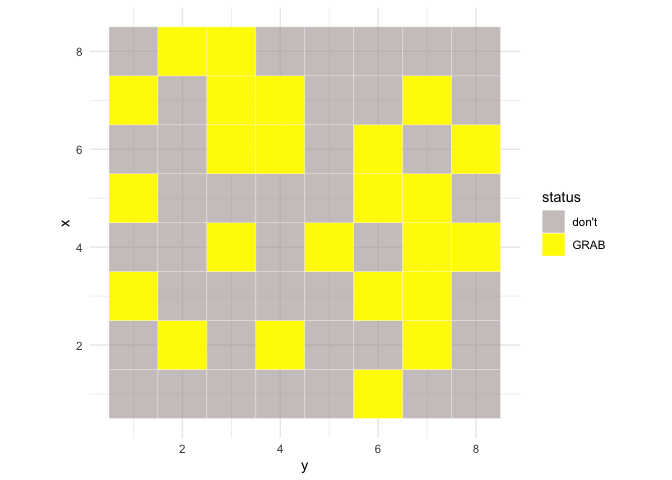

# CandyHapsinatoR2000

<!-- badges: start -->

[](https://github.com/mariegiehmoverby/CandyHapsinatoR2000/actions/workflows/R-CMD-check.yaml)
<!-- badges: end -->

The goal of CandyHapsinatoR2000 is to decide what candy to mix.

## Installation

You can install the development version of CandyHapsinatoR2000 from
[GitHub](https://github.com/mariegiehmoverby/CandyHapsinatoR2000) with:

``` r
# Install the package
devtools::install_github("mariegiehmoverby/CandyHapsinatoR2000")
```

## Vignette

You can find the vignette for CandyHapsinatoR2000
[HERE](https://github.com/mariegiehmoverby/CandyHapsinatoR2000/tree/master/vignettes)

## Example

This is a basic example which shows you can use the function

``` r
library(CandyHapsinatoR2000)
candy <- hapsinatoR(pricePer100g = 10, snollerMoney = 100, numRows = 8, numCols = 8, handfulSize = "large")
```

The input in `print()` must be a hapsinatoR object.

``` r
print(candy)
#> A hapsinatoR object
#> Number of candies: 64 
#> Tile statuses:
#> 
#> don't  GRAB 
#>    40    24 
#> Coordinates of candies to GRAB:
#> (3,1)  (5,1)  (7,1)  (2,2)  (8,2)  (4,3)  (6,3)  (7,3)  (8,3)  (2,4)  (6,4)  (7,4)  (4,5)  (1,6)  (3,6)  (5,6)  (6,6)  (2,7)  (3,7)  (4,7)  (5,7)  (7,7)  (4,8)  (6,8)
```

Summary of the hapsinatoR object will give you a summary of the candy
mix.

``` r
summary(candy)
#> =================================
#> Summary of hapsinatoR object
#> =================================
#> Number of different candies: 64 
#> Number of candies to GRAB: 32 
#> Total grams to mix: 1000 
#> Total grams mixed: 1002 
#> =================================
#> Candies to GRAB are at locations:
#> (3,1)  (5,1)  (7,1)  (2,2)  (8,2)  (4,3)  (6,3)  (7,3)  (8,3)  (2,4)  (6,4)  (7,4)  (4,5)  (1,6)  (3,6)  (5,6)  (6,6)  (2,7)  (3,7)  (4,7)  (5,7)  (7,7)  (4,8)  (6,8)
```

Plotting the hapsinatoR object will give you a visual representation of
what candy to mix.

``` r
plot(candy)
```


